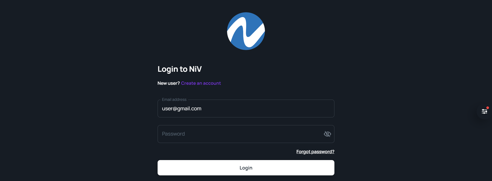
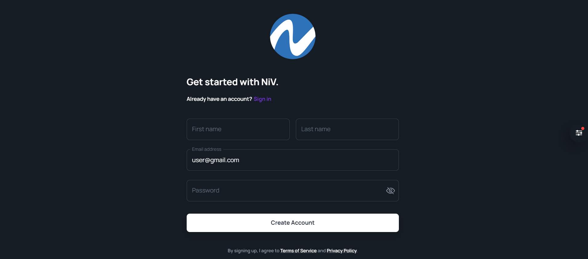
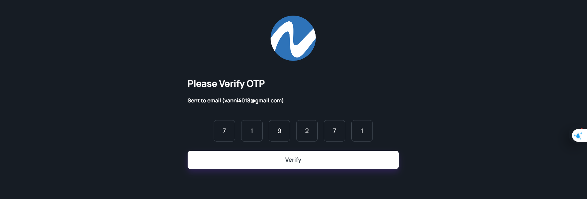
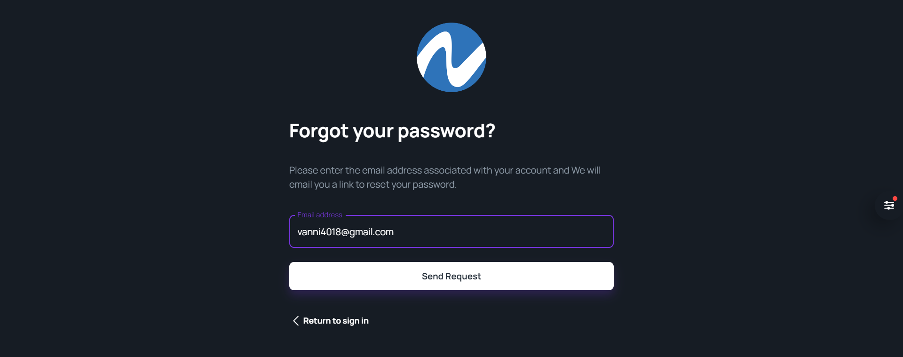
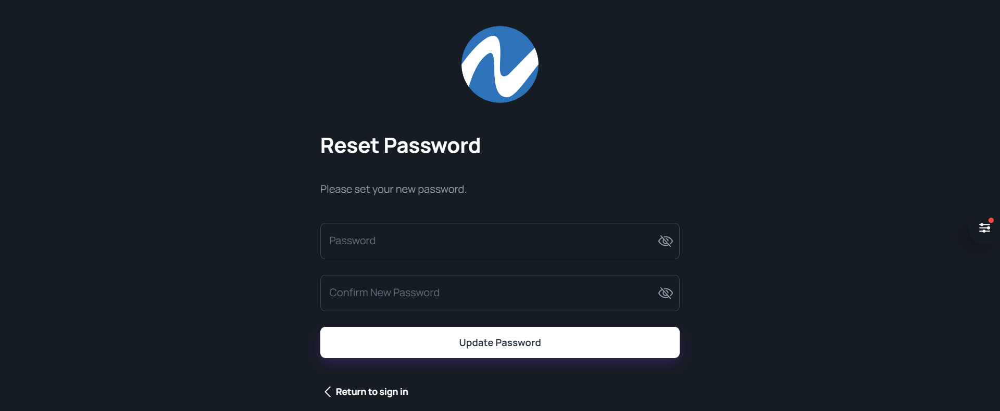
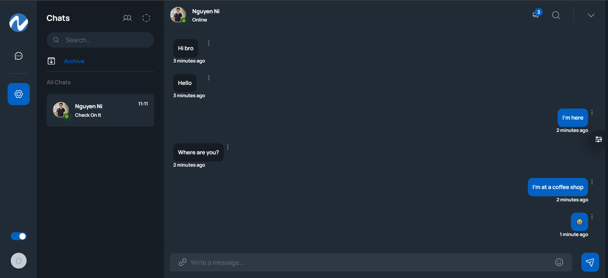

# Chat App

```
Login Account: 

User1:
user1@gmail.com 
user1@123

User2:
user2@gmail.com 
user@123
```

# Authentication

## Login 
****

## Register  
**



## Forgot password
  
  
  
  
## One-to-one chat  
  
  
## Some features:  
  
⚛️ Tech Stack: React.js, MongoDB, Node.js, Express.

🔐 Authentication with JSONWEBTOKENS (JWT)

🔥 Friend requests, accept a friend

👥 One to one chat

🌐 Deployment

⏳ And much more!

**Start the app**

```js
npm install

npm start

```
